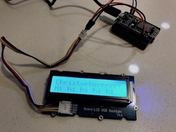
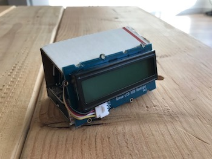
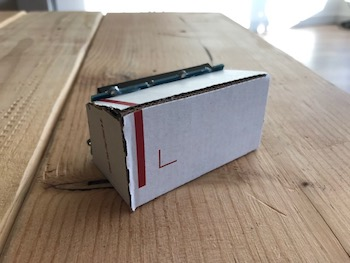
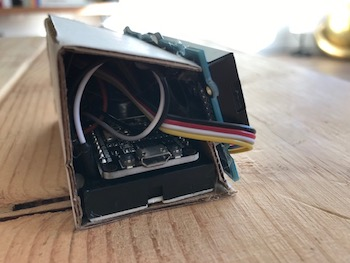
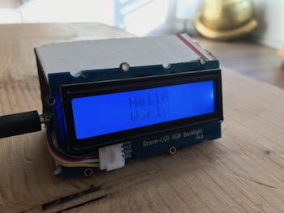
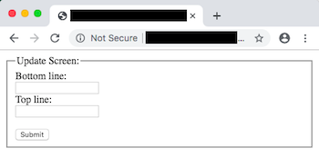

# smart-nametag

## Description

The goal behind this project was to pair a Grove RGB two-line LCD screen with a NodeMCU (ESP8266) in order to display dynamic text from the web.  Accompanying the firmware code (in Arduino) is a small Python Flask webapp that serves up a minimal HTML page for updating the text as well as serves up the text in a format that the NodeMCU can understand.

This assumes some prior knowledge of Python, AWS, and the EB CLI.  Instructions for how to copy this project found below.

## Photos
- Prototype Phase
    - 
- "Final" Housing Assembly
    -  
    -  
- Web app
    - 

## Deploy web app to AWS

1. Create a virtual environment
    - `virtualenv flask-smart-nametag`

2. Source the virtual environment
    - `source flask-smart-nametag/bin/activate`

3. Install the Python dependencies
    - `pip3 install -r requirements.txt`

4. Setup the AWS Elastic Beanstalk instance
    - `eb init`

5. Push and deploy your web app
    - `eb create` (or use `eb deploy` to update)

6. Visit the URL for your deployment (*e.g. http://smart-nametag.us-west-2.elasticbeanstalk.com*) and ensure that it greets you with "Hello, world!"

## Flash firmware to NodeMCU

1. Install [the ESP8266 libraries](https://github.com/esp8266/Arduino) for the Arduino IDE.

2. Load libraries required to interface with the LCD as well as make our HTTP *GET* requests.
    - [rgb_lcd.h](https://github.com/Seeed-Studio/Grove_LCD_RGB_Backlight)

3. Load the firmware file located at [arduino/smart-nametag.ino](arduino/smart-nametag.ino) into the Arduino IDE.

4. Modify lines of the Arduino code for your particular situation
    - [Line 11](https://github.com/ckuzma/smart-nametag/blob/master/arduino/smart-nametag.ino#L11): Your deployment address from above with "/iot" appended to it.  (*e.g. http://smart-nametag.us-west-2.elasticbeanstalk.com/iot*)
    - [Lines 16-18](https://github.com/ckuzma/smart-nametag/blob/master/arduino/smart-nametag.ino#L16): Modify values from 0 to 255 to change the RGB balance of the LCD backlight.
    - [Line 72](https://github.com/ckuzma/smart-nametag/blob/master/arduino/smart-nametag.ino#L72): Put your WiFi access point's SSID and password in the appropriate lines.
    - [Line 73](https://github.com/ckuzma/smart-nametag/blob/master/arduino/smart-nametag.ino#L73): You can uncomment if you want to seamlessly move your project between different WiFi environments and have it automatically connect.  Repeat this line to add multiple if you'd like!

5. Flash the Arduino code to the NodeMCU.

## How to update the LCD screen

1. If you visit your deploy URL at the route */update* (*e.g. http://smart-nametag.us-west-2.elasticbeanstalk.com/update*) you will be brought to the web app portal that will allow you to enter text.

2. Those more tech savvy will obviously pick up on the fact that the webapp is RESTful in nature and can modify their existing projects to directly *POST* data to the webapp. (See [line 23](https://github.com/ckuzma/smart-nametag/blob/master/application.py#L23) of the Flask application to get started.)

## Credits

- ["Deploying a Flask application to AWS"](https://medium.com/@rodkey/deploying-a-flask-application-on-aws-a72daba6bb80) by [@inkjet](https://github.com/inkjet) (aka "Scott Rodkey") on Medium was exceptionally useful navigating Amazon's deployment intricacies.